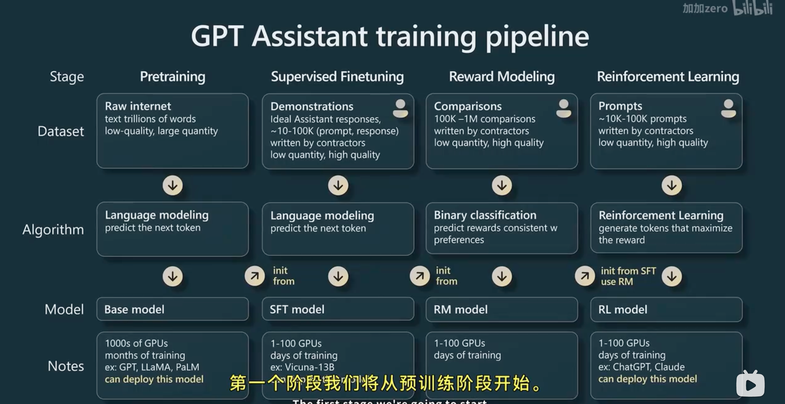
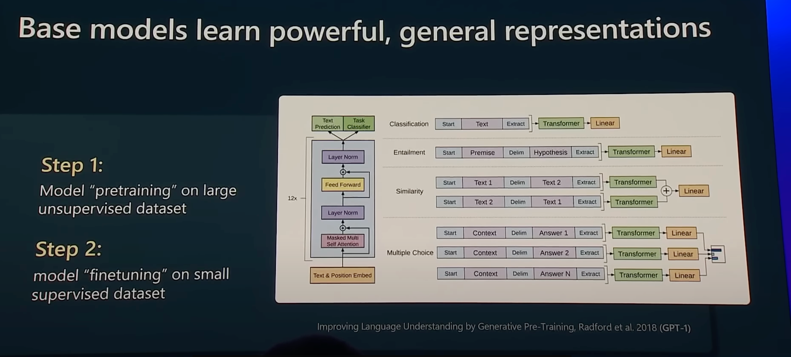
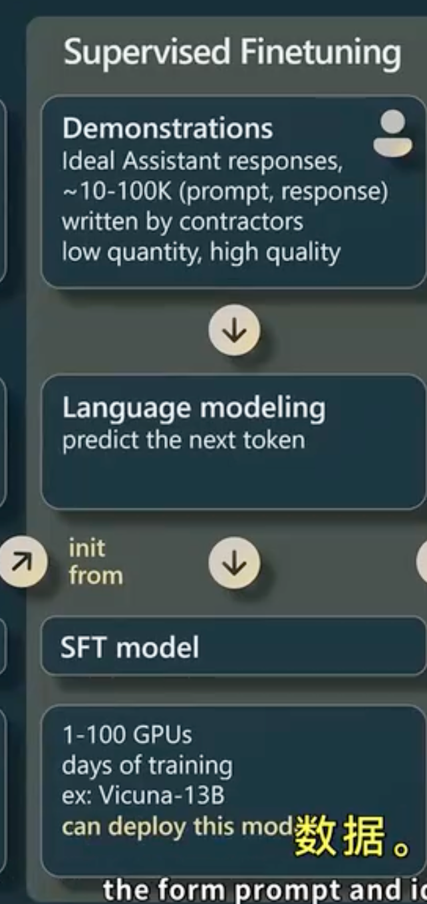
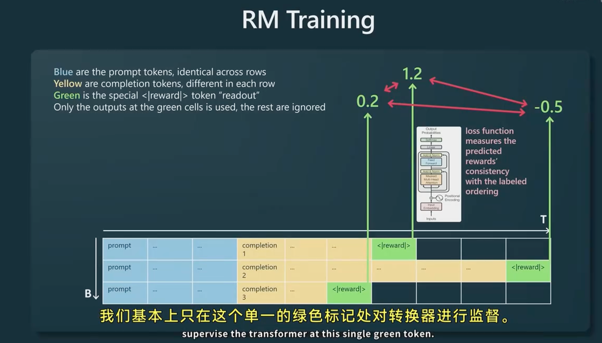
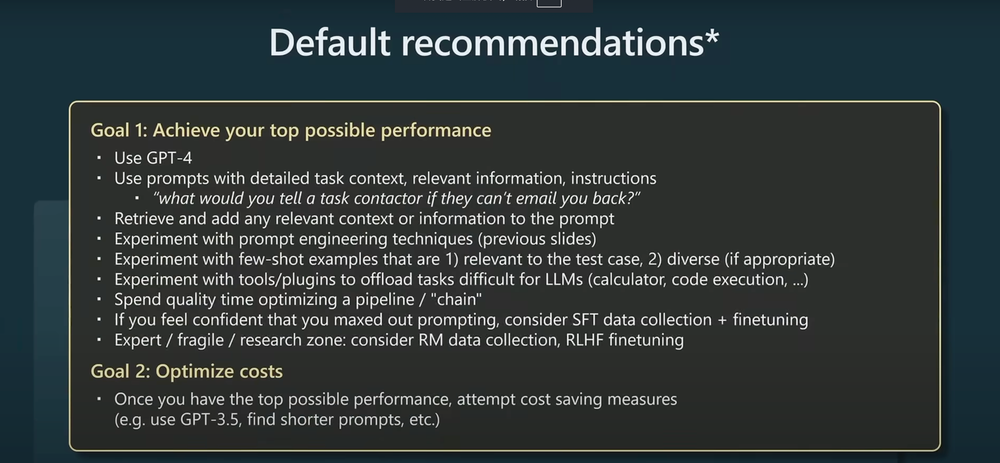

## 预训练
大量计算，大量GPU,数月训练时间
- tokenization:迭代text chunks and groups them into tockens
- 取出tocken,lay them out into batches
- 然后将(B,T)的数据喂到transformer，[transformer原理](image-1.png)绿色单元格会查看它之前所有的token，预测红色tocken(监督学习)
  
## 监督微调
- 下游任务[GPT1]
- prompt these model effectively(few-shot prompt提示词工程，让他们认为自己在),注意base model 和assistant model的区别
- 
  1. 差不多仅仅是更换了数据集，以QA的形式，低数量，高质量
  2. 训练之后，得到FST模型（可以部署为助理模型）

（RLHF基于人类反馈强化学习）
## 奖励建模
- 将数据收集的形式转化为比较形式，只监督学习绿色标记处(reward标记)
- 有了奖励模型，我们可以打分评估任意给定提示的完成情况（有利于进一步强化学习）
## 强化学习
- 再次收集了大量的提示!
- 初始化SFT模型，创建一些黄色标记的完成情况，并再次添加奖励标记[过程](image-5.png)
- 保持固定的奖励模型读取奖励。
- 现在奖励模型告诉我们这些提示词每一个的完成情况 。现在差不多用相同的语言建模损失函数。我们目前是在黄色标记进行训练，我们根据奖励模型的指示的奖励加权语言建模目标

## RLHF VS Base model 
- RLHF模型损失了一些熵，输出的结果更尖锐 

## Apply GPT model to your problems
- 人的思维由浅入深，一环接一环。而模型只会模仿下一个TOken,不会反思
- 如果你的任务需要很多推理，你不能期望Transformer对每个Token都推理，应该将推理分散到越来越多的标记上(例如不能给Transformer一个很复杂的问题，而仅仅希望凭借单个Token就的出答案)Transformer need token to think.!可以通过思维链，[思维链](image-6.png)，减少每一个Token的计算量

## 自洽性
- 可能一开始采样到一个不好的Token
- 可以在生成后再提出一个prompt让它检查任务的完成情况

## Tree of tought

## Chains $ Agent
- think , action ,obervation

## Retrieval-Augmented Generation (RAG)
- 向量化库，检索，余弦相似度，填充到prmpt
  

## Constraint prompting

## Suggestiongs
